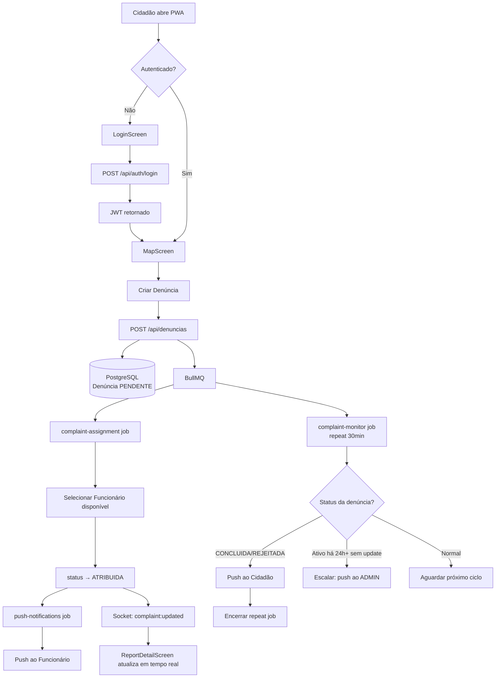
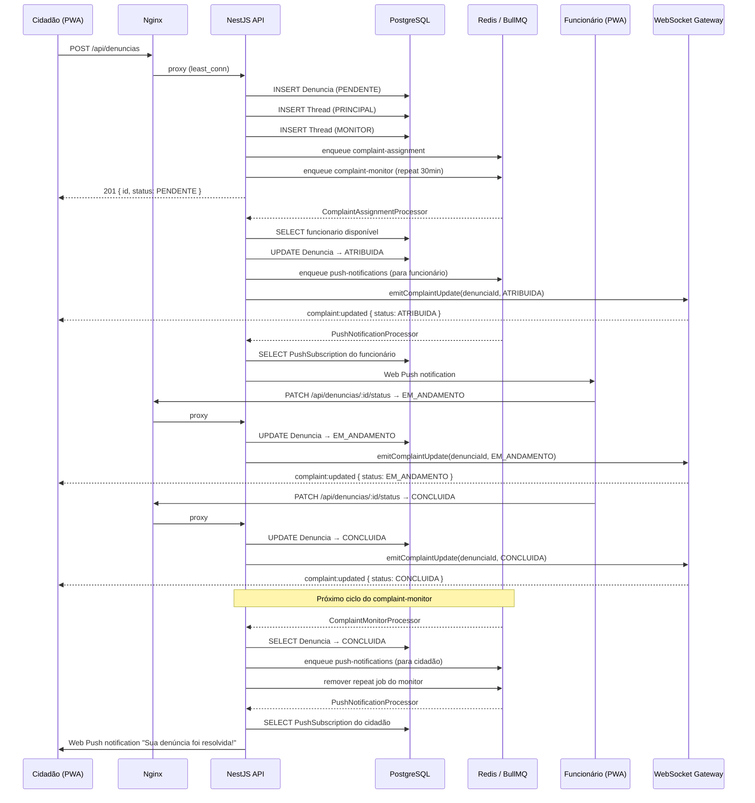
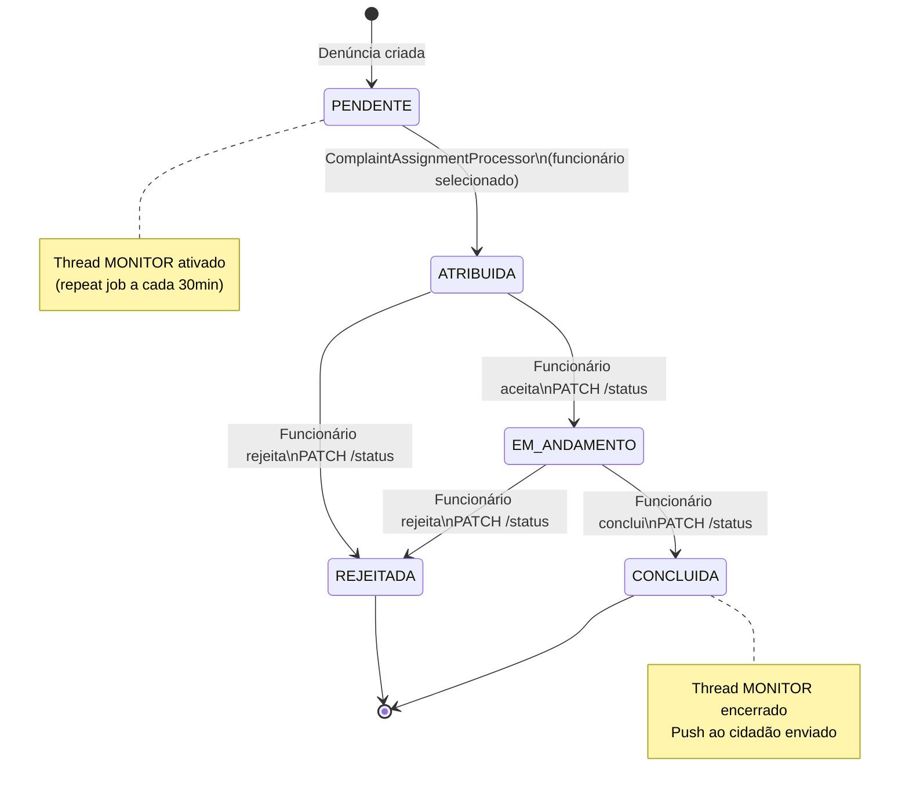
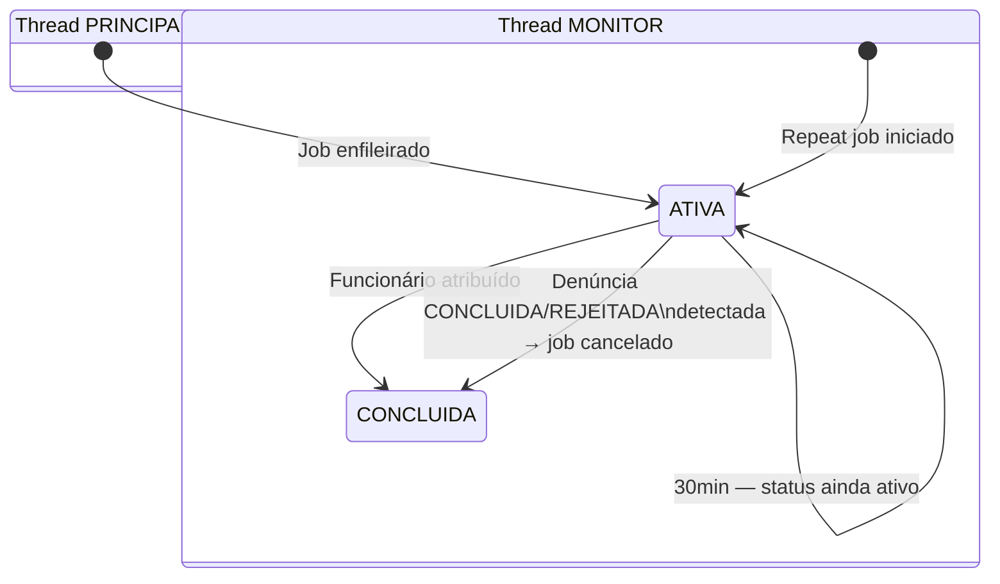

# Arquitetura — Denúncias Urbanas

## Visão Geral

```
[Cidadão PWA / Funcionário ]
         │  HTTPS
         ▼
    [Nginx :80]
    upstream least_conn
    WebSocket upgrade headers
         │
    ┌────┴────┐
    ▼         ▼
[api_1:3000] [api_2:3000]   ← NestJS (2 réplicas)
    │         │
    └────┬────┘
         │ PrismaClient
         ▼
   [PostgreSQL :5432]

    ┌────┴────┐
    ▼         ▼
[api_1]   [api_2]
    │         │
    └────┬────┘
         │ ioredis / BullMQ
         ▼
     [Redis :6379]
     (fila + pub/sub)

BullMQ Queues:
  complaint-assignment  → ComplaintAssignmentProcessor
  complaint-monitor     → ComplaintMonitorProcessor (repeat 30min)
  push-notifications    → PushNotificationProcessor

WebSocket:
  NotificationsGateway (socket.io) ← emitido pelos processors
```

---

## Fluxograma Geral



---

## Diagrama de Sequência — Ciclo Completo de uma Denúncia



---

## Diagrama de Estados





---

## Stack

| Camada | Tecnologia |
|--------|-----------|
| Frontend | React 18 + Vite + TypeScript + Tailwind CSS v4 |
| PWA | vite-plugin-pwa + Workbox |
| Real-time client | socket.io-client |
| Backend | NestJS 10 + TypeScript |
| ORM | Prisma + PostgreSQL 16 |
| Filas | BullMQ + Redis 7 |
| WebSockets | @nestjs/websockets + socket.io |
| Push | web-push (VAPID) |
| Auth | bcrypt + @nestjs/jwt + passport-jwt |
| Infra | Docker Compose + Nginx (least_conn load balancer) |

---

## Variáveis de Ambiente

| Variável | Descrição |
|----------|-----------|
| `DATABASE_URL` | Connection string PostgreSQL |
| `REDIS_URL` | URL do Redis |
| `JWT_SECRET` | Segredo para assinar JWTs |
| `VAPID_PUBLIC_KEY` | Chave pública VAPID para Web Push |
| `VAPID_PRIVATE_KEY` | Chave privada VAPID |
| `VAPID_EMAIL` | Email para o header VAPID |
| `VITE_API_URL` | URL base da API (frontend) |
| `VITE_VAPID_PUBLIC_KEY` | Chave pública VAPID exposta ao frontend |
